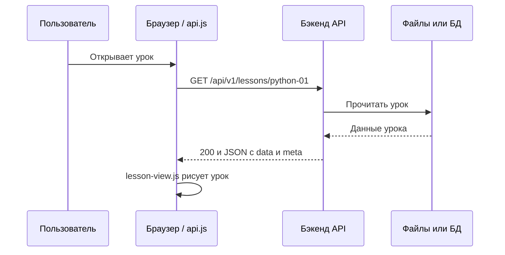
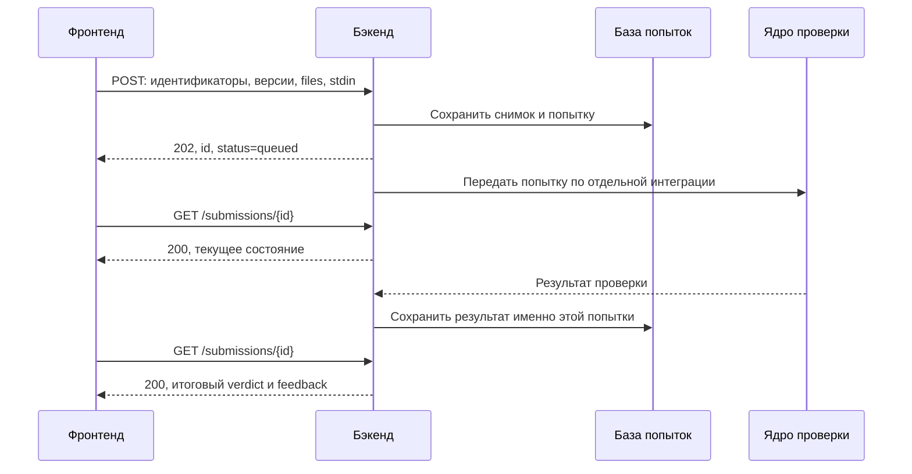

# LogicKernel: как устроен проект и как подключить бэкенд

LogicKernel — учебный сайт. Пользователь выбирает курс, читает урок, пишет решение в редакторе и отправляет его на проверку.

**Распределение работы:** фронтенд показывает интерфейс и отправляет текст решения; бэкенд отдаёт материалы, определяет пользователя, сохраняет попытку и передаёт её ядру; **ядро проверяет решение**; бэкенд получает результат ядра и возвращает его фронтенду. Протокол передачи между бэкендом и ядром здесь намеренно не описывается: это отдельная договорённость, она не нужна для понимания подключения интерфейса.

Это руководство для начинающего бэкенд-разработчика. Оно объясняет слова, файлы, сетевой обмен и точные форматы данных, чтобы можно было последовательно реализовать серверную часть.

## Что уже есть, а что предстоит подключить

В репозитории есть интерфейс на HTML, CSS и обычном JavaScript, 11 курсов по 60 уроков и 20 модулей, всего 660 практик, а также 6 отдельных задач JavaScript. Можно читать материалы, редактировать код и сохранять черновики в браузере.

Сейчас `config.js` содержит `mode: 'mock'`: курсы загружаются локально, кнопка отправки сообщает, что проект в разработке. Пользовательский код в браузере не выполняется; отправка в этом режиме не создаёт попытку и не начисляет награду.

Уже подготовлены клиент HTTP API, форматы запросов и ответов, JSON для импорта и работающий пример сервера материалов. **Настоящие аккаунты, постоянное хранение попыток, подключение ядра и серверная синхронизация прогресса здесь ещё не реализованы.** Начальная статистика, профиль и сертификаты демонстрационные. Наличие примера ответа `accepted` не означает наличие подключённой проверки.

## Содержание

1. [Термины и JSON: что такое поле](#1-термины-и-json-что-такое-поле)
2. [Как работает передача по сети](#2-как-работает-передача-по-сети)
3. [Карта файлов проекта](#3-карта-файлов-проекта)
4. [Первый запуск и первый GET](#4-первый-запуск-и-первый-get)
5. [Что бэкенду делать с пакетом материалов](#5-что-бэкенду-делать-с-пакетом-материалов)
6. [Какие HTTP-методы реализовать](#6-какие-http-методы-реализовать)
7. [Как устроены данные курса и урока](#7-как-устроены-данные-курса-и-урока)
8. [Как фронтенд передаёт файлы решения](#8-как-фронтенд-передаёт-файлы-решения)
9. [Как бэкенду принять и сохранить попытку](#9-как-бэкенду-принять-и-сохранить-попытку)
10. [Граница ответственности бэкенда и ядра](#10-граница-ответственности-бэкенда-и-ядра)
11. [Как вернуть результат фронтенду](#11-как-вернуть-результат-фронтенду)
12. [Ошибки и повторная отправка](#12-ошибки-и-повторная-отправка)
13. [Готовые библиотеки и структура бэкенда](#13-готовые-библиотеки-и-структура-бэкенда)
14. [Авторизация, CORS и размещение](#14-авторизация-cors-и-размещение)
15. [Пошаговый план разработки и проверки](#15-пошаговый-план-разработки-и-проверки)
16. [Как обновлять материалы и документацию](#16-как-обновлять-материалы-и-документацию)

## 1. Термины и JSON: что такое поле

**Фронтенд** — программа в браузере пользователя. Она рисует страницу, считывает текст редактора, отправляет запросы и показывает ответы. Здесь это файлы `index.html`, `styles.css` и JavaScript.

**Бэкенд** — программа на сервере. Она принимает запросы браузера, читает материалы, работает с базой данных и связывает интерфейс с ядром. Язык бэкенда не обязан совпадать с JavaScript фронтенда или языком решения ученика.

**Ядро** — отдельный компонент проверки решений. Бэкенд передаёт ему сохранённую попытку и получает результат. Бэкенд не должен сам запускать код ученика или самостоятельно решать, верен ли ответ.

**API** — набор адресов и правил общения с программой. **Контракт API** — договорённость: на какой адрес обращаться, что передать и какой ответ получить. Машинное описание текущего контракта лежит в `backend-package/openapi.json`; это руководство объясняет тот же обмен человеческим языком.

**JSON** — текстовый формат данных. Учебный пример, не полный ответ урока:

```json
{
  "id": "python-01",
  "version": 1,
  "hasPractice": true,
  "nextId": null,
  "objectives": ["Прочитать пример", "Написать программу"]
}
```

| Запись | Объяснение |
| --- | --- |
| `{ ... }` | Объект: набор именованных значений. |
| `"id": "python-01"` | **Поле** — пара «имя: значение». Имя здесь `id`, значение — строка `python-01`. Это не поле ввода на странице. |
| `"version": 1` | Числовое значение. `1` и `"1"` различаются: второе является строкой. Для версии нужна именно цифра без кавычек. |
| `true`, `false` | Логические значения: да и нет. Пишутся без кавычек. |
| `null` | Значения нет. Это не пустая строка и не строка `"null"`. |
| `[ ... ]` | Массив, то есть упорядоченный список. `[]` — пустой список. |
| `data.exercise.files[0].path` | В объекте `data` взять `exercise`, затем массив `files`, его первый элемент и его поле `path`. Индексы начинаются с нуля. |
| `files[].code` | Сокращение в документации: поле `code` у каждого элемента массива `files`. |

В JSON строки и имена заключают в двойные кавычки. Комментарии и запятая после последнего элемента запрещены. Перевод строки внутри строки записывают как `\n`, кавычку — как `\"`. Лучше формировать JSON библиотекой, а не склеивать вручную.

**Сериализация** превращает объект программы в текст JSON. **Десериализация**, или разбор, превращает JSON обратно в объект. В JavaScript это `JSON.stringify(object)` и `JSON.parse(text)`.

**ID, или идентификатор** — устойчивое имя записи: `python` обозначает курс, `python-01` — урок, `python-01-practice` — упражнение. Название для человека может измениться; связи между объектами используют ID.

**Схема JSON** — правила проверки структуры: какие поля обязательны, где нужна строка, где число, какие значения разрешены. Схемы лежат в `backend-package/schemas`. Они проверяют формат сообщения, а не правильность программы ученика.

**Попытка, или submission** — отдельная сохранённая отправка решения. **Снимок решения** — точная копия текста в момент отправки. Последующие изменения редактора не должны изменять уже сохранённую попытку.

**База данных, или БД** хранит записи между перезапусками сервера. **Транзакция** объединяет операции: они применяются целиком либо откатываются при ошибке. **Валидация** — проверка, что входные данные соответствуют правилам.

## 2. Как работает передача по сети

### Адрес, порт и маршрут

Возьмём `http://127.0.0.1:4180/api/v1/lessons/python-01`:

| Часть адреса | Значение |
| --- | --- |
| `http://` | Протокол общения. Для публичного сайта используется HTTPS — зашифрованное соединение. |
| `127.0.0.1` | Этот же компьютер. `localhost` тоже обычно указывает на локальный компьютер. |
| `4180` | Порт: номер, по которому система направляет соединение определённой серверной программе. |
| `/api/v1` | Общий префикс адресов API проекта. |
| `/lessons/python-01` | Путь к ресурсу: уроку `python-01`. |

**Маршрут** связывает HTTP-метод и путь с функцией сервера: например, «на GET этого адреса найти урок и вернуть JSON». Путь API не обязан совпадать с путём файла на диске.

### Что такое GET и POST

**HTTP-запрос** — сообщение от браузера серверу: метод, адрес, заголовки и иногда тело.

- **GET** означает «получи данные». Здесь он читает каталог, урок, историю и состояние попытки. У этих GET нет тела. GET не создаёт попытку и не запускает новую проверку.
- **POST** означает «передай данные для обработки». Здесь он отправляет решение и создаёт попытку. Текст решения находится в теле запроса.
- **Заголовки** — служебные пары «имя: значение». `Content-Type: application/json` сообщает формат тела.
- **Тело** — сами передаваемые данные. В нашем POST это JSON с идентификаторами и текстами файлов.
- **HTTP-ответ** — сообщение обратно: числовой статус, заголовки и тело.

Текстовое представление GET в HTTP/1.1 выглядит так; реальные сетевые детали формирует библиотека:

```http
GET /api/v1/lessons/python-01 HTTP/1.1
Host: 127.0.0.1:4180
Accept: application/json
```

Сервер возвращает статус `200 OK`, заголовок `Content-Type: application/json; charset=utf-8` и тело — содержимое `backend-package/responses/lessons/python-01.json`. `200` означает успешное получение; `Accept` — «клиент ожидает JSON»; `Content-Type` — «сообщение содержит JSON»; UTF-8 — кодировка, поддерживающая русский текст.

Не нужно вручную писать TCP-клиент, разбивать данные на пакеты или рассчитывать длину сообщения. `fetch` в браузере и HTTP-библиотека сервера выполняют передачу. Для обычного HTTP/1.1 или HTTP/2 под ними работает TCP, HTTPS добавляет TLS. На уровне приложения ты получаешь разобранный запрос и формируешь ответ.

У удалённого сайта доменное имя сначала преобразуется через DNS в сетевой адрес. Запрос к `127.0.0.1` остаётся на своём компьютере. GitHub хранит репозиторий; `git push` сам по себе не запускает бэкенд.

### Как данные появляются на экране



Бэкенд отвечает по соединению, которое открыл браузер. Ему не нужно отдельно искать адрес пользователя и «отправлять файл фронту». **Вернуть JSON из обработчика HTTP-запроса и есть передать данные фронтенду.** Фронтенд затем создаёт разметку из полученного объекта.

Адрес страницы `http://localhost:4173/#/lesson/python/python-01` отличается от API-адреса. Часть после `#` серверу не передаётся; её обрабатывает `app.js`. Маршрут `#/lesson/...` на бэкенде создавать не нужно.

## 3. Карта файлов проекта

Пути здесь указаны относительно корня полного репозитория. Если тебе передали только ZIP, внутри него есть папка `backend-package`: путь `backend-package/catalog-import.json` означает `catalog-import.json` в этой папке. Файлов фронтенда в ZIP нет; для их изменения нужен полный репозиторий.

### Приложение

| Файл | Назначение и действие бэкенд-разработчика |
| --- | --- |
| `index.html` | Оболочка сайта и подключение скриптов. Отдаётся браузеру как статический файл. Скрипты с `defer` выполняются по порядку; общие объекты доступны через `window`. |
| `styles.css`, `assets/favicon.svg` | Оформление и значок. Отдавать как статику. Шрифт Manrope подключается через Google Fonts; без сети есть запасной шрифт. |
| `config.js` | Режим данных и адрес API. Изменить при подключении сервера. Не хранить здесь секреты: файл читается браузером. |
| `api.js` | Готовый клиент API: `fetch`, заголовки, JSON, ошибки и таймауты. Здесь смотреть реальные адреса запросов. |
| `app.js` | Каталог, навигация, профиль, задачи, состояние и localStorage. `bootstrapCourses` получает каталог; `render` выбирает экран по адресу. |
| `lesson-view.js` | Программа курса, урок, редактор, отправка практики, опрос статуса, история. |
| `task-submit.js` | Отправка шести отдельных задач. Использует другой POST, чем практика урока. |
| `content/tasks.js` | Публичные условия отдельных задач. Загружаются локально даже в HTTP-режиме. |
| `server.mjs`, `start.cmd` | Раздача файлов для разработки на порту 4173. API здесь нет; для публичного размещения этот сервер не предназначен. |
| `README.md`, `BACKEND.md` | Полное руководство и краткая точка входа в разработку бэкенда. |
| `LogicKernel-backend-package.zip` | Пакет для передачи разработчику. Посетителю сайта скачивать его не нужно. |

### Исходные материалы и инструменты

| Путь | Назначение |
| --- | --- |
| `content/curriculum.js` | Общие описания и базовые уроки Python, JavaScript, C#. |
| `content/systems.js` | Базовые уроки C, C++, Go, Rust. |
| `content/web-and-data.js` | Базовые уроки HTML/CSS, SQL, TypeScript, алгоритмов. |
| `content/advanced-core.js` | Общая генерация расширенных уроков. |
| `content/advanced-*.js` | Продолжения курсов: `python`, `js`, `ts`, `csharp`, `go`, `rust`, `c`, `cpp`, `html`, `sql`, `algorithms`. Здесь редактируют соответствующие мастерские. |
| `content/mock-bundle.js` | Сгенерированные локальные ответы курсов. В HTTP-режиме не загружается. Для импорта на бэкенде используй JSON, а не исполнение этого JavaScript. |
| `tools/build-content.mjs` | Собирает материалы в JSON, Markdown и mock-bundle; запускает генерацию OpenAPI. |
| `tools/build-openapi.mjs` | Создаёт `backend-package/openapi.json`. |
| `tools/package-backend.ps1` | Копирует README в пакет, собирает материалы, валидирует и создаёт ZIP. |
| `tools/verify-contract.mjs` | Проверяет API-клиент и совпадение HTTP-ответов с материалами. |
| `verify.mjs` | Проверяет интерфейс через Microsoft Edge с тестовым API. Ядро не запускает. |
| `tools/upgrade-app.mjs` | Исторический скрипт преобразования интерфейса. Для подключения бэкенда не запускать. |
| `verification/` | Отчёты и скриншоты. `results-v2.json`, `contract-results.json` — результаты текущих проверок; `results.json` — исторический отчёт. |
| `.gitignore` | Исключения для Git, включая зависимости и временный профиль браузера. |

### Содержимое `backend-package/`

| Файл или папка | Что это | Что делать |
| --- | --- | --- |
| `manifest.json` | Оглавление: версии, количества, пары endpoint → file, SHA-256. | Использовать при загрузке и проверке файлов. Контрольная сумма обнаруживает изменение, но не удостоверяет доверие к источнику. |
| `catalog-import.json` | Все курсы и уроки одним документом. | Импортировать в БД или загрузить в память. Это не ответ `GET /courses`. |
| `courses/*.json` | Каждый курс отдельно вместе с уроками. | Альтернативный импорт по одному курсу. Не создавать дубли из двух представлений. |
| `courses/*.md` | Материалы для чтения человеком. | Читать; не отправлять вместо JSON API. |
| `responses/courses/index.json` | Готовое тело ответа каталога. | Вернуть целиком на `GET /api/v1/courses`. |
| `responses/courses/<id>.json` | Готовая программа одного курса. | Вернуть на `GET /api/v1/courses/<id>`. |
| `responses/lessons/<id>.json` | Готовый урок с практикой. | Вернуть на `GET /api/v1/lessons/<id>`. |
| `task-import.json` | Публичные данные шести задач. | Импортировать и сверять задачи по `taskId` и версии. |
| `schemas/content.schema.json` | Правила структуры материалов. | Валидировать выдачу материалов. |
| `schemas/submission-request.schema.json`, `schemas/submission-response.schema.json` | Запрос и результат практики урока. | Проверять сообщения `/submissions`. |
| `schemas/task-submission-request.schema.json`, `schemas/task-submission-response.schema.json` | Запрос и результат отдельной задачи. | Проверять сообщения `/task-submissions`. |
| `examples/*.json` | Примеры тел запросов и ответов. | Использовать для тестирования формата. Это не реальные результаты проверки присланного кода. |
| `runtime-profiles.json` | Описания профилей среды проверки. | Хранить согласованные ID и сверять их с заданиями. Реализация выполнения относится к ядру. |
| `fixtures/*.sql` | Учебные данные SQLite и PostgreSQL. | Это материалы для проверки SQL ядром; не выполнять их в БД аккаунтов приложения. |
| `openapi.json` | Машинный контракт HTTP API. | Читать вместе с соседней папкой `schemas`, на которую он ссылается. |
| `serve.mjs` | Работающий пример API материалов. | Запустить и изучить способ выдачи готовых ответов. |
| `validate.mjs`, `validation-report.json` | Валидатор и отчёт. | Запустить проверку после получения или изменения пакета. |
| `README.md`, `BACKEND.md` | Инструкция получателю пакета и копия этого руководства. | Читать внутри распакованного ZIP. |

## 4. Первый запуск и первый GET

Нужен Node.js; проверки проекта выполняются на Node 24. У репозитория нет `package.json`, обязательных npm-зависимостей и шага `npm install` для запуска этих серверов.

Открой PowerShell в корне проекта:

```powershell
cd "$HOME\Desktop\LogicKernel"
node --version
node backend-package/validate.mjs
node backend-package/serve.mjs
```

Последняя команда не завершается: сервер слушает `127.0.0.1:4180`. Оставь окно открытым. Остановка — Ctrl+C. Если проект находится в другом каталоге, измени путь в `cd`.

Во втором терминале:

```powershell
curl.exe -i http://127.0.0.1:4180/api/v1/courses
curl.exe -i http://127.0.0.1:4180/api/v1/lessons/python-01
```

`curl.exe` — программа для HTTP-запросов. Без дополнительных параметров выполняет GET; `-i` показывает заголовки. Должны прийти `200` и JSON. Это настоящая передача по HTTP между программами на одном компьютере.

Чтобы подключить интерфейс к этому API, временно замени `config.js`:

```js
window.LK_CONFIG = Object.freeze({
  mode: 'http',
  baseUrl: 'http://127.0.0.1:4180/api/v1',
  mockLatencyMs: 100,
  requestTimeoutMs: 10000,
  pollIntervalMs: 800,
  maxPollDurationMs: 30000
});
```

Во втором окне запусти фронтенд:

```powershell
cd "$HOME\Desktop\LogicKernel"
node server.mjs
```

Открой `http://localhost:4173`. Нажми F12 → **Network / Сеть**, затем открой каталог, курс Python и первый урок. Найди GET `courses`, `courses/python`, `lessons/python-01`; посмотри их статус и вкладку Response. Урок также загружает историю `/submissions?lessonId=python-01`.

Отправка решения на пример API вернёт **503** и `RUNNER_NOT_CONFIGURED`. Это существующее имя ошибки означает, что проверка не подключена. В целевой архитектуре бэкенду предстоит подключить ядро. Сам `serve.mjs` возвращает материалы, пустую историю существующего урока и ошибку отправки; GET конкретной попытки пока не реализован.

Пояснение настроек:

| Имя | Значение |
| --- | --- |
| `mode` | `mock` — локальные материалы, `http` — обращения к API. |
| `baseUrl` | Начало адреса. `api.js` дописывает `/courses` и другие пути. Завершающий `/` не нужен. |
| `requestTimeoutMs` | Предел ожидания одного HTTP-запроса. 10000 мс = 10 секунд. |
| `pollIntervalMs` | Обычная пауза между запросами статуса попытки. |
| `maxPollDurationMs` | Предел одного цикла ожидания в интерфейсе; не время проверки решения ядром. |
| `mockLatencyMs` | Искусственная задержка локальных материалов; в HTTP-режиме не используется. |

Для автономного просмотра верни `mode: 'mock'`. В этом режиме можно открыть `index.html` напрямую; подключение API проверяй через HTTP. `start.cmd` запускает локальный сервер, а если Node не найден — открывает HTML напрямую.

## 5. Что бэкенду делать с пакетом материалов

### Сначала можно отдавать готовые JSON без БД

Скопируй `backend-package` на сервер как данные, доступные приложению. Прочитай `manifest.json`, затем каждый файл из его массива `files`. Сохрани соответствие «адрес API → содержимое файла».

Например, запись manifest связывает `/api/v1/lessons/python-01` с `responses/lessons/python-01.json`. Когда приходит GET этого адреса, сервер отвечает содержимым файла с `200` и `Content-Type: application/json; charset=utf-8`. Для неизвестного адреса верни JSON-ошибку 404. Именно так работает `serve.mjs`.

Не превращай присланный пользователем путь в произвольный путь к файлу. Используй заранее загруженную карту разрешённых маршрутов или поиск по ID.

Есть два корректных способа отправки:

- Прочитал файл как текст — отправь этот текст как готовое JSON-тело.
- Разобрал файл в объект — передай объект JSON-методу фреймворка.

**Не сериализуй готовый JSON-текст второй раз.** Иначе ответом станет строка с экранированными кавычками вместо объекта с `data` и `meta`.

Для выдачи неизменяемых материалов БД не обязательна. Попыткам и аккаунтам нужно постоянное хранилище. После изменения файлов перезапусти `serve.mjs`: он держит ответы в памяти.

### Если материалы должны храниться в БД

Верхний уровень `catalog-import.json`:

| Поле | Содержание |
| --- | --- |
| `schemaVersion` | Строка `"1.0"`, версия формата. |
| `contentVersion` | Версия набора материалов. Бери значение из импортируемого файла. |
| `courses` | Массив 11 полных курсов с модулями. |
| `lessons` | Массив 660 полных уроков с упражнениями. |

В `courses/python.json` вместо массива `courses` находится объект `course`, а `lessons` содержит только уроки Python. Это альтернативное представление тех же данных.

Порядок импорта:

1. Прочитать файл как UTF-8 и разобрать JSON средствами своего языка.
2. Проверить формат, уникальность ID и связи уроков с курсами. Перед этим можно запустить готовый валидатор пакета.
3. В транзакции сохранить курсы и уроки. Для первой реализации удобно хранить каждый курс и урок целым JSON-документом.
4. Сохранить внешние ID: `python`, `python-01` и другие. Внутренний числовой ключ БД допустим, но API должен возвращать ID из материалов.
5. Повторный импорт того же ID и версии обновляет существующую запись, а не создаёт дубль. Старые версии, на которые ссылаются попытки, сохраняются.
6. Сохранить `contentVersion`. Это версия пакета; она не заменяет `lesson.version` и `exercise.version`.
7. Отдельно импортировать `task-import.json` для отдельных задач. Закрытых тестов в нём нет.

При выдаче из БД собирай ту же структуру, что в `responses`: для `/courses` — карточки без `modules`; для `/courses/python` — полный курс; для `/lessons/python-01` — полный урок. **Не возвращай весь импортный файл вместо ответа API.**

Пример таблиц будущего бэкенда, не готовые миграции из репозитория:

| Таблица | Что хранить |
| --- | --- |
| `course_versions` | Внешний ID, версия, JSON программы, версия пакета. |
| `lesson_versions` | ID и версия урока, связь с курсом, JSON с упражнением. |
| `task_versions` | ID, версия и описание отдельной задачи. |
| `submissions` | ID попытки, владелец, тип и версии задания, снимок запроса, статус, результат, даты. |
| `idempotency_keys` | Пользователь, маршрут, ключ повтора, отпечаток тела, ID попытки. |
| `completions` | Подтверждённое прохождение и данные для защиты от повторного начисления. |

Внутренние имена таблиц могут быть другими. JSON-контракт с фронтендом от этого не меняется.

## 6. Какие HTTP-методы реализовать

В таблице указан полный путь с `/api/v1`. `{id}` обозначает подставляемое значение, а не буквальные фигурные скобки.

| Метод и путь | Когда вызывается | Ответ |
| --- | --- | --- |
| `GET /api/v1/courses` | Загрузка каталога. | `200`, все карточки в массиве `data`. Пагинация каталога не поддерживается. |
| `GET /api/v1/courses/{courseId}` | Открытие курса или программы при загрузке урока. | `200`, один полный курс в `data`. |
| `GET /api/v1/lessons/{lessonId}` | Открытие урока. | `200`, полный урок, включая теорию и практику. |
| `POST /api/v1/submissions` | Отправка практики урока. | `202`, сохранённая попытка в `data`. |
| `GET /api/v1/submissions/{submissionId}` | Опрос результата или открытие попытки. | `200`, состояние, результат и снимок попытки. |
| `GET /api/v1/submissions?lessonId=python-01` | Загрузка истории урока. | `200`, до 20 последних попыток текущего пользователя, новые первыми. |
| `POST /api/v1/task-submissions` | Отправка отдельной задачи. | `202`, попытка задачи. |
| `GET /api/v1/task-submissions/{submissionId}` | Опрос результата отдельной задачи. | `200`, состояние и результат задачи. |

`?lessonId=python-01` — параметр строки запроса. Извлеки его средствами фреймворка и используй как фильтр. Это не имя файла.

Все успешные ответы имеют оболочку `data` и `meta`. Например, **полный ответ пустой истории**:

```json
{
  "data": [],
  "meta": { "schemaVersion": "1.0" }
}
```

У курса, урока и попытки `data` — объект, у каталога и истории — массив. В материалах сохраняй `meta.contentVersion`, в каталоге также `meta.total` и `meta.nextCursor: null`, как в готовых файлах.

`api.js` проверяет наличие `data` и точную строку `meta.schemaVersion === '1.0'`. Просто массив без оболочки, число `1` вместо строки `"1.0"`, HTML-страница или пустой 204 вместо JSON не подходят. Глубокую проверку полей должен обеспечивать бэкенд: проверка клиента минимальна.

`202` означает «принято в обработку», а не «решение правильное». Правильность определяется по итоговому `data.verdict`. **В теле POST-запроса оболочка `data` не используется**, она нужна успешным ответам.

## 7. Как устроены данные курса и урока

Сначала передавай материалы без изменений. Этот раздел объясняет структуру для дальнейшего хранения и сборки ответов из БД.

### Карточка, программа и урок

| Объект | Поля и смысл |
| --- | --- |
| Карточка курса | `id`, `slug` — ID и адресное имя; `title`, `subtitle`, `description` — тексты; `level`, `category`, `language` — уровень, категория и язык; `hours` — оценка времени; `lessons` — **число** уроков; `teacher` — автор; `version` — версия; `prerequisites` — требования; `outcomes` — список результатов обучения; `base` — исходное 0, не прогресс пользователя. |
| Программа курса | Всё из карточки плюс `modules` — массив модулей. |
| Модуль | `id`, `title`, `position`, `lessons`. Здесь `lessons` уже **массив кратких ссылок на уроки**. |
| Ссылка на урок | `id`, `title`, `position`, `estimatedMinutes`, `hasPractice`. Полной теории здесь нет. |
| Полный урок | `id`, `courseId`, `moduleId`, `position`, `slug`, `title`, `version`, `estimatedMinutes`, `level`, `objectives`, `blocks`, `exercise`, `references`, `navigation`, `completionPolicy`. |

`position` начинается с нуля; позиция урока считается по всему курсу. Массивы отдавай уже в нужном порядке. `objectives` — список целей. `references` — объекты с текстом `label` и адресом `url`. В `navigation.previousId` и `navigation.nextId` лежат ID соседних уроков; на границах курса — `null`.

`completionPolicy` равен `server_accepted_submission`: чтение теории не означает принятую практику. Бэкенд подтверждает прохождение после результата ядра.

ID курсов: `python`, `js`, `ts`, `csharp`, `go`, `rust`, `c`, `cpp`, `html`, `sql`, `algorithms`. `js` — ID курса, а его язык — `javascript`; у `ts` язык `typescript`; алгоритмы используют JavaScript. Эти значения нельзя подменять друг другом.

### Теория: `blocks`

`blocks` — массив частей урока в порядке чтения. У каждого блока есть `id`, `type` и данные своего типа:

| `type` | Остальные данные | Отображение |
| --- | --- | --- |
| `paragraph`, `heading` | `text` | Абзац или заголовок. |
| `reference` | `title`, `text` | Справка. |
| `code` | `title`, `language`, `filename`, `code` | Пример кода с именем файла. |
| `callout` | `tone`: `info` или `warning`; `title`, `text` | Выделенная информация или предупреждение. |
| `steps`, `checklist` | `title`, `items` — массив строк | Шаги или список проверки. |
| `glossary` | `title`, `items` — объекты с `term`, `definition` | Словарь терминов. |

Не склеивай блоки в HTML. Бэкенд отдаёт JSON, фронтенд сам рисует разметку и экранирует текст. Учебный пример кода отображается как текст, а не выполняется.

### Практика: `exercise`

| Поле | Смысл |
| --- | --- |
| `id`, `version` | ID и версия упражнения; сверяются при отправке. |
| `title`, `prompt` | Заголовок и условие для ученика. |
| `language` | Язык упражнения, например `python`. |
| `runtimeProfileId` | ID согласованного профиля проверки, например `python-intro-v1`. Это не команда запуска. |
| `files` | Шаблоны файлов для вкладок редактора. |
| `entryFile` | Главный файл, например `main.py`; совпадает с одним `files[].path`. |
| `stdin` | Настройки ввода: `enabled`, `defaultValue`, `label`, `help`. Здесь это объект настроек. |
| `publicExamples` | Публичные примеры: `id`, `input`, `expectedOutput`, `description`. |
| `hints` | Массив текстовых подсказок. |
| `constraints` | `maxCodeBytes`, `maxStdinBytes`, `timeLimitMs`, `memoryLimitMb`: ограничения размера и параметры проверки. |
| `grading` | `strategy`, `serverOnly: true`, `hiddenTestsIncluded: false`. |
| `fixture` | У SQL: `id`, `label`, `tables` с учебными данными. |
| `review` | У расширенных работ: `kind`, `criteria`, `projectScope`, `tradeoff` — вид работы, критерии, объём, вопрос об инженерном выборе. |

Каждый шаблон `exercise.files` имеет `path`, `language`, `editable`, `starterCode`. `starterCode` — исходный текст до правок ученика. Сейчас все файлы редактируемые; блокировка `editable: false` во фронтенде не реализована. Закрытые служебные материалы проверки сюда не включаются.

Стратегии: `program` — программа, `query` — SQL, `document` — HTML/CSS, `review` — работа с критериями ревью. Это метаданные задания для согласования с ядром, а не предложение реализовать четыре проверяющих механизма в бэкенде.

Уроки 1–12 каждого курса вводные, 13–60 — мастерские реализации, проверки и проектной работы. Расширенные уроки используют `review` и дополнительные файлы, включая Markdown-отчёт. Оценка времени включает самостоятельную практику; прохождение материалов не гарантирует профессиональный уровень.

## 8. Как фронтенд передаёт файлы решения

Здесь есть разные виды файлов:

1. **Файлы пакета**, например `responses/lessons/python-01.json`: бэкенд читает их для выдачи материалов.
2. **Виртуальные файлы редактора**, например вкладка `main.py`: пока ученик печатает, это текст в браузере и черновике localStorage.
3. **Сохранённые файлы попытки**: бэкенд получает их как имена и строки, сохраняет снимок и использует его при передаче задания ядру.

Фронтенд **не загружает ZIP и не использует multipart/form-data**. Он отправляет все файлы одним JSON. Полное тело POST практики первого урока:

```json
{
  "lessonId": "python-01",
  "lessonVersion": 1,
  "exerciseId": "python-01-practice",
  "exerciseVersion": 1,
  "language": "python",
  "runtimeProfileId": "python-intro-v1",
  "files": [
    {
      "path": "main.py",
      "code": "print(\"Привет, LogicKernel!\")\nprint(\"Это моя первая программа\")\n"
    }
  ],
  "stdin": ""
}
```

Адрес — `POST /api/v1/submissions`. Заголовки: `Content-Type: application/json`, `Accept: application/json`, `Idempotency-Key: <ключ отправки>`. Про ключ подробно ниже.

| Поле запроса | Откуда взялось | Действие бэкенда |
| --- | --- | --- |
| `lessonId`, `lessonVersion` | `id`, `version` открытого урока. | Найти и проверить серверную версию урока. |
| `exerciseId`, `exerciseVersion` | `exercise.id`, `exercise.version`. | Проверить, что упражнение относится именно к этому уроку и версии. |
| `language`, `runtimeProfileId` | Из `exercise`. | Сверить с серверными данными. Клиент не выбирает произвольные правила проверки. |
| `files` | Тексты вкладок на момент нажатия. | Проверить допустимый набор, размеры, сохранить все элементы. |
| `files[].path` | Имя из шаблона, например `main.py`. | Это относительное имя файла решения, не путь на компьютере посетителя и не URL. |
| `files[].code` | Текст ученика. | Хранить как строку без изменения; не выполнять в HTTP-обработчике. |
| `stdin` | Введённый текст или пустая строка. | Проверить размер и сохранить. Здесь это **строка**, хотя в описании упражнения `stdin` был объектом настроек. |

В POST внутри `files` передаются только `path` и `code`. Поля шаблона `starterCode`, `editable`, `language` туда не добавляются. Неизвестные дополнительные поля запрещены схемой запроса. `userId` также не передаётся: сервер определяет пользователя по сессии.

Сохраняй исходный текст без `.trim()`, HTML-экранирования или замены переводов строк. Эти преобразования могут изменить решение. Для сохранения в SQL используй параметры запроса или ORM; для формирования JSON — сериализатор.

### Несколько исходников и Markdown

В `python-60` редактор содержит `main.py`, `component.py`, `design.md`. Они передаются тремя элементами одного `files`. Полный пример — `backend-package/examples/submission-review-request.json`; он содержит стартовые шаблоны, а не готовое правильное решение.

Текст Markdown тоже хранится в `code`. Отдельный метод загрузки отчёта не нужен. В занятиях реализации документ обычно `README.md`, проверки — `tests.md`, проекта — `design.md`; точные имена бери из версии упражнения.

**`README.md` внутри решения — документ ученика, а не README репозитория.** Бэкенд не должен перезаписывать собственные файлы по присланным именам. Можно хранить весь снимок JSON в БД; создавать физические файлы для приёма HTTP-запроса не требуется. Все части решения должны сохраниться при передаче ядру; способ такой передачи здесь не задаётся.

### Отдельные задачи

Раздел `#/tasks` использует `POST /api/v1/task-submissions`. Полный пример тела:

```json
{
  "taskId": "reverse",
  "taskVersion": 1,
  "language": "javascript",
  "runtimeProfileId": "javascript-functions-v1",
  "files": [
    {
      "path": "solution.js",
      "code": "function reverseString(str) { return [...str].reverse().join(''); }"
    }
  ],
  "stdin": ""
}
```

Здесь нет `lessonId` и `exerciseId`. Бэкенд находит задачу в импортированных данных по `taskId`, сверяет `taskVersion` и профиль. Описание задачи содержит имя требуемой функции; для `reverse` это `reverseString`. Проверяет функцию ядро.

У текущего фронтенда нет `GET /tasks` и API истории отдельных задач. Условия читаются из `content/tasks.js`, поэтому этот файл и серверный импорт задач надо обновлять согласованно.

## 9. Как бэкенду принять и сохранить попытку

Ниже порядок реализации **будущего** `POST /api/v1/submissions`. Он проверяет допустимость сообщения, но не правильность решения.

1. Определить пользователя по сессии и проверить право отправки. Для cookie-аутентификации проверить CSRF-защиту из раздела 14.
2. Ограничить размер HTTP-тела при чтении. Лимит всего тела должен учитывать JSON-оболочку и экранирование, поэтому это не ровно 65536 байт. Например, 1 MiB можно использовать как начальный транспортный лимит, затем отдельно проверять размеры содержимого.
3. Проверить `Content-Type`, разобрать JSON и валидировать по `submission-request.schema.json`.
4. Найти серверную запись урока и упражнения, сверить ID, версии, язык и профиль. При несовместимой версии вернуть `409 CONTENT_VERSION_MISMATCH`.
5. Проверить набор `files`: схема допускает 1–10 элементов, но реальные допустимые имена и обязательные файлы определяет упражнение. Отклонять дубликаты, пропуски, посторонние имена, абсолютные пути, `..` и нулевые символы. Достаточно строкового типа для пути не является проверкой безопасности.
6. Посчитать суммарный размер всех `files[].code` в **байтах UTF-8**: сейчас максимум 65536. Для `stdin` максимум 8192. Длина строки в символах отличается от байтов; в Node можно использовать `Buffer.byteLength(text, 'utf8')`. `maxLength` из схемы не заменяет эту проверку.
7. Прочитать `Idempotency-Key` и проверить, не сохранена ли такая отправка раньше.
8. В транзакции сохранить неизменяемый снимок, пользователя, версии, серверный ID, даты и начальные `status: 'queued'`, `verdict: null`, `isDemo: false`. Сохранить связь ключа повтора с попыткой.
9. Обеспечить передачу сохранённой попытки на проверку ядру по отдельной интеграции. При сбое не терять запись; её состояние должно оставаться доступным и позволять восстановить обработку.
10. Вернуть `202` с сохранённой попыткой, не удерживая запрос до окончания долгой проверки.

Для `/task-submissions` последовательность такая же, но используется схема отдельной задачи и её ID/версия.

### Почему важен Idempotency-Key

Ученик нажал отправку; сервер сохранил данные, но связь оборвалась до ответа. Браузер не знает, была ли создана попытка, и повторяет запрос с тем же ключом.

**Идемпотентность** здесь означает: одинаковая повторная отправка возвращает прежнюю попытку вместо создания новой. Нужна уникальность `(user_id, route, idempotency_key)` в БД, чтобы даже два одновременных запроса не создали дубль.

Сохрани отпечаток тела — значение, позволяющее сравнить его содержимое. Тот же ключ и другое тело должны дать конфликт 409, а не заменить старое решение. Отпечаток можно вычислять по нормализованному разобранному JSON: порядок свойств не должен случайно менять смысл запроса.

Фронтенд сохраняет ключ, пока тело неизменно, и создаёт новый после изменения решения. Для первой реализации связь ключа и попытки разумно сохранять на срок жизни попытки; слишком раннее удаление создаст дубли после позднего повтора.

## 10. Граница ответственности бэкенда и ядра



Диаграмма показывает обязанности и направление данных, **не протокол общения с ядром**. Здесь не выбираются его адреса, транспорт, формат сообщений или внутренний способ исполнения.

| Фронтенд | Бэкенд | Ядро |
| --- | --- | --- |
| Показывает материалы и редактор. | Отдаёт материалы по HTTP и управляет доступом. | Проверяет решения. |
| Отправляет снимок текста. | Валидирует запрос, сохраняет снимок и версии, передаёт попытку ядру. | Определяет результат по правилам задания. |
| Запрашивает статус. | Хранит состояние, связывает результат ядра с исходной попыткой, отдаёт JSON клиенту. | Возвращает результат бэкенду. |
| Показывает обратную связь. | Сохраняет подтверждённое прохождение и не начисляет награды повторно. | Не требует прямого обращения из браузера. |

Бэкенд не принимает `accepted` от браузера и не выводит его из факта успешной доставки. Основанием служит результат ядра, связанный с нужной попыткой и версией. Результат нельзя привязать к «последнему черновику»: черновик мог измениться.

Если внутренний формат ядра отличается от клиентского, на стороне бэкенда нужен слой преобразования **в описанный ниже публичный ответ**. Нельзя просто вернуть неизвестный клиенту статус или произвольный объект ядра.

Поля `runtimeProfileId`, `grading`, `review`, учебные SQL fixtures относятся к описанию задания. Бэкенд проверяет их согласованность с сохранённой версией, но не реализует по ним собственный запуск кода. Публичные примеры не заменяют проверку ядра; у пакета явно `hiddenTestsIncluded: false`.

Проверка или ревью могут длиться дольше ожидания браузера. Попытка продолжает существовать на сервере, результат доступен позже. Если ядро ещё не подключено, используй понятную ошибку, например существующую `503 RUNNER_NOT_CONFIGURED`, а не фиктивный успешный результат.

## 11. Как вернуть результат фронтенду

### Ответ на POST

После сохранения верни `202` и JSON такого вида:

```json
{
  "data": {
    "id": "sub_example_001",
    "lessonId": "python-01",
    "lessonVersion": 1,
    "exerciseId": "python-01-practice",
    "exerciseVersion": 1,
    "status": "queued",
    "verdict": null,
    "createdAt": "2026-09-22T10:00:00Z",
    "updatedAt": "2026-09-22T10:00:00Z",
    "isDemo": false,
    "feedback": null,
    "pollAfterMs": 800
  },
  "meta": { "schemaVersion": "1.0" }
}
```

ID и даты примерные: реальные создаёт сервер. `Z` в дате означает UTC. `pollAfterMs` предлагает задержку до следующего запроса статуса в миллисекундах.

### Как фронтенд узнает об окончании

Он периодически вызывает `GET /api/v1/submissions/sub_example_001`. Это **polling**, то есть опрос. WebSocket текущему интерфейсу не нужен. Каждый GET возвращает существующее состояние с HTTP 200; он не создаёт новую попытку и не отправляет её повторно на проверку.

Перед выдачей проверь владельца. Хранилище результата — бэкенд: браузеру не нужно напрямую обращаться к ядру.

Клиент обычно опрашивает каждые 800 мс; фактическая пауза ограничивается 300–5000 мс. После примерно 30 секунд одного ожидания интерфейс предлагает проверить позже. Остановка ожидания или уход со страницы не отменяют проверку. API отмены в текущем контракте нет.

Особенность уроков: `lesson-view.js` запрашивает GET попытки после POST даже если POST уже вернул итог. Поэтому GET обязателен и при очень быстрой проверке. В отдельных задачах `task-submit.js` продолжает опрос только для `queued` или `running`.

### Статус не равен вердикту

| `status` | `verdict` | Значение для фронтенда |
| --- | --- | --- |
| `queued` | `null` | Попытка сохранена и ожидает обработки. |
| `running` | `null` | Идёт проверка. |
| `finished` | Итог из списка ниже | Проверка завершена. |
| `failed` | `internal_error` | Сбой обработки попытки. |
| `not_evaluated` | `null` | Резерв схемы для демонстрации с `isDemo: true`. Не использовать как настоящий результат. Текущий mock вообще отклоняет отправку. |

Итоги: `accepted` — принято; `wrong_answer` — условия не выполнены; `compilation_error` — ошибка сборки; `runtime_error` — ошибка выполнения; `time_limit` — превышено время; `memory_limit` — память; `internal_error` — внутренняя проблема проверки. Бэкенд представляет полученный результат ядра этими согласованными значениями.

Для длительного ревью сохраняй совместимые статусы. Не отдавай клиенту `awaiting_review` без изменения схем и интерфейса; внутренние состояния бэкенда могут быть подробнее внешних.

### Итоговый GET

Пример ответа **после подтверждённой успешной проверки ядром**:

```json
{
  "data": {
    "id": "sub_example_001",
    "lessonId": "python-01",
    "lessonVersion": 1,
    "exerciseId": "python-01-practice",
    "exerciseVersion": 1,
    "status": "finished",
    "verdict": "accepted",
    "createdAt": "2026-09-22T10:00:00Z",
    "updatedAt": "2026-09-22T10:00:02Z",
    "isDemo": false,
    "files": [
      {
        "path": "main.py",
        "code": "print(\"Привет, LogicKernel!\")\nprint(\"Это моя первая программа\")\n"
      }
    ],
    "stdin": "",
    "feedback": {
      "summary": "Программа выводит обе строки в нужном порядке.",
      "stdout": "Привет, LogicKernel!\nЭто моя первая программа\n",
      "stderr": "",
      "diagnostics": [],
      "tests": [
        { "name": "Публичный пример", "passed": true, "message": "Вывод совпал с условием." }
      ]
    }
  },
  "meta": { "schemaVersion": "1.0" }
}
```

Это пример формы ответа, не заготовка для безусловного принятия любой программы.

| Данные результата | Что показывать и хранить |
| --- | --- |
| `feedback.summary` | Понятное человеку объяснение. |
| `stdout`, `stderr` | Разрешённые к показу вывод программы и сообщения среды. |
| `diagnostics` | Массив замечаний: обязательный `message`, при наличии `file`, `line`, `column`, `severity`. Строки и колонки с 1; severity — `error`, `warning`, `info`. |
| `tests` | Публичные результаты: `name`, `passed`, при наличии `message`, `expectedOutput`, `actualOutput`. |
| `files`, `stdin` | Сохранённый исходный снимок этой попытки, не текущий черновик. |

Не публикуй приватные входы и эталоны тестов, секреты и внутренние служебные логи. Если ядро отдаёт больше информации, чем разрешено показывать ученику, публичный ответ формируется из разрешённых данных.

**Возвращай `lessonVersion` и `exerciseVersion`.** Схема допускает их отсутствие, но интерфейс сравнивает обе версии с открытым уроком и без совпадения не засчитает практику. Успешный зачёт требует `status: 'finished'`, `verdict: 'accepted'`, `isDemo: false` и совпадения ID и версий.

История возвращает до 20 объектов попыток в массиве `data`, новые первыми. Не вкладывай в него отдельные оболочки `{data, meta}`. Для истории и GET одной попытки возвращай `files` и `stdin`, чтобы пользователь видел свой отправленный код. Старые версии остаются старыми; не переписывай их номером текущего урока.

У отдельной задачи вместо ID урока и упражнения используются `taskId`, `taskVersion`. Полный пример — `examples/task-submission-accepted.json`. Интерфейс сверяет задачу и версию и выводит `feedback.summary`.

## 12. Ошибки и повторная отправка

Ошибка API возвращается с неуспешным HTTP-статусом и объектом `error`, без оболочки успешного результата:

```json
{
  "error": {
    "code": "CONTENT_VERSION_MISMATCH",
    "message": "Версия задания изменилась. Обновите урок; ваш код сохранён.",
    "details": { "lessonId": "python-01", "expectedLessonVersion": 2 },
    "requestId": "req_example_001"
  }
}
```

`code` — машинное имя; `message` — сообщение человеку; `details` — безопасные подробности или `null`; `requestId` — необязательный идентификатор для поиска серверного лога.

Ниже рекомендуемая политика ошибок будущего бэкенда. OpenAPI задаёт общий формат ошибки, но не фиксирует все перечисленные имена:

| HTTP | Пример code | Когда |
| --- | --- | --- |
| `400` | `INVALID_REQUEST` | Сломанный JSON, неверный состав или типы. |
| `401` | `UNAUTHENTICATED` | Нет действующей сессии для защищённой операции. |
| `403` | `FORBIDDEN` | Нет права выполнить действие, в том числе не прошла CSRF-проверка. |
| `404` | `NOT_FOUND` | Нет ресурса либо чужая попытка скрыта от пользователя. |
| `409` | `CONTENT_VERSION_MISMATCH` | Версия несовместима. Это имя учитывается интерфейсом специально. |
| `409` | `IDEMPOTENCY_CONFLICT` | Тот же ключ с другим телом. |
| `413` | `PAYLOAD_TOO_LARGE` | Слишком большое тело или содержимое. |
| `415` | `UNSUPPORTED_MEDIA_TYPE` | Неподдерживаемый формат вместо JSON. |
| `429` | `RATE_LIMITED` | Слишком частые отправки. |
| `500` | `INTERNAL_ERROR` | Сбой API; подробности остаются в логе. |
| `503` | `RUNNER_NOT_CONFIGURED` | Проверка не подключена; так отвечает пример сервера. |

Неверное решение — **успешно полученный результат проверки**: GET обычно возвращает 200, а `data.verdict` — `wrong_answer` или другой итог. Ошибку компиляции не надо превращать в HTTP 500.

`api.js` различает `INVALID_RESPONSE`, `TIMEOUT`, `NETWORK_ERROR`. Отвечай JSON даже при ошибках авторизации и неизвестном API-маршруте; HTML-страница входа вместо JSON не подходит. Таймаут POST не доказывает, что сервер ничего не сохранил: повтор использует прежний ключ.

## 13. Готовые библиотеки и структура бэкенда

Писать сетевой транспорт вручную не нужно. Используй готовый HTTP-сервер своего языка. Это варианты для **нового бэкенда**, не зависимости, уже установленные в этом репозитории:

| Язык | HTTP | JSON |
| --- | --- | --- |
| Node.js | Встроенный `node:http`, как в `serve.mjs`, либо Express. | `JSON` и JSON-парсер фреймворка. |
| Python | FastAPI с ASGI-сервером. | Модели Pydantic и JSON-сериализация. |
| Go | Стандартный `net/http`. | Стандартный `encoding/json`. |

Express связывает метод и адрес с обработчиком; FastAPI умеет разбирать тело в модель; Go предоставляет HTTP-сервер в стандартной библиотеке. Официальные инструкции: [Express: маршруты](https://expressjs.com/en/starter/basic-routing/), [FastAPI: тело запроса](https://fastapi.tiangolo.com/tutorial/body/), [Go: net/http](https://pkg.go.dev/net/http).

Пример принципа выдачи через Express. Это фрагмент для отдельного сервера; `packageRoot` — абсолютный путь к папке `backend-package`:

```js
const raw = await readFile(path.join(packageRoot, 'responses/courses/index.json'), 'utf8');
const catalogResponse = JSON.parse(raw);

app.get('/api/v1/courses', (req, res) => {
  res.status(200).json(catalogResponse);
});
```

`app.get` регистрирует обработчик GET, `req` представляет запрос, `res` — ответ; `.json` сериализует объект и отправляет клиенту. Для запуска нужны импорты, создание приложения и `listen`. Полный запускаемый пример без внешних зависимостей уже есть в `backend-package/serve.mjs`.

Для POST фреймворк разбирает JSON в объект запроса, после чего твой код выполняет проверки из раздела 9. Стандартные ошибки фреймворка приведи к `{error: {code, message, details}}`: его собственный формат не всегда совпадает с форматом клиента.

Возможное разбиение будущего бэкенда, не существующее дерево файлов:

```text
backend/
  app                  запуск HTTP-сервера и конфигурация
  routes/content       три GET материалов
  routes/submissions   POST, GET результата, GET истории
  routes/tasks         POST и GET отдельных задач
  services/import      импорт материалов и версий
  services/attempts    валидация, идемпотентность, сохранение
  integrations/kernel граница подключения ядра
  storage              запросы БД и миграции
```

Содержимое интеграции с ядром определяется отдельно. Для фронтенда важно, чтобы публичные маршруты и JSON оставались описанными здесь.

## 14. Авторизация, CORS и размещение

### Почему локальные два порта требуют CORS

`http://localhost:4173` и `http://127.0.0.1:4180` — разные **origin**. Origin — сочетание протокола, хоста и порта. Даже один хост с разными портами считается разным origin.

Браузер ограничивает чтение ответа другого origin. **CORS** — заголовки разрешения такого чтения. Пример `serve.mjs` разрешает локальные HTTP-origin `localhost:<порт>` и `127.0.0.1:<порт>` и отвечает на `OPTIONS`.

**OPTIONS preflight** — предварительный запрос браузера: разрешён ли POST с JSON и заголовком `Idempotency-Key`. Сервер перечисляет допустимые методы и заголовки. Если curl работает, а браузер пишет CORS error, проверь OPTIONS и заголовки во вкладке Network. curl не применяет браузерную политику CORS.

CORS не заменяет авторизацию: произвольный клиент всё равно может обратиться к серверу. Права проверяет сам бэкенд.

### Размещение на одном origin

Для текущего клиента удобна схема:

```text
https://learn.example/
  /index.html, /app.js, ... -> статические файлы
  /api/v1/...              -> приложение бэкенда
```

Публичный HTTPS может принимать reverse proxy — сервер, направляющий `/api/v1/...` в приложение бэкенда, а остальные адреса обслуживающий статикой. Сохрани согласованный префикс пути при проксировании. В `config.js` используй `mode: 'http'` и `baseUrl: '/api/v1'`; остальные настройки как в разделе 4.

Публикуемые файлы: `index.html`, `styles.css`, `config.js`, `api.js`, `app.js`, `lesson-view.js`, `task-submit.js`, `content/tasks.js`, `assets/favicon.svg`. Для HTTP-режима mock-bundle не нужен. ZIP, импортный пакет, инструменты и отчёты не нужны в публичной папке сайта. Ядро не требует публичного браузерного API в этой схеме.

### Откуда берётся пользователь

Вход сейчас не реализован. Нужно добавить серверные сессии и интерфейс входа либо отдельно согласовать другой механизм авторизации.

`fetch` в `api.js` использует `credentials: 'same-origin'`: подходящие cookies отправляются тому же origin. После входа сервер устанавливает cookie сессии, затем по ней определяет пользователя. Не доверяй `userId` из JSON или localStorage. Проверь владельца при каждом чтении попытки и истории.

Для cookie-сессий настрой `HttpOnly`, `Secure` при HTTPS, подходящий `SameSite`, срок действия и отзыв. Для изменяющих запросов нужна CSRF-защита: сервер выдаёт токен, фронтенд передаёт, сервер проверяет.

`api.js` добавляет `X-CSRF-Token` к не-GET запросам, **если** в странице есть `meta[name="csrf-token"]`. Автоматической загрузки токена пока нет. Её надо реализовать через выдачу HTML сервером или отдельную начальную загрузку с клиентскими изменениями.

Если API на другом origin использует cookies, одной смены `baseUrl` недостаточно: потребуется `credentials: 'include'`, разрешение конкретного origin и credentials на сервере, подходящие cookie-настройки. `Access-Control-Allow-Origin: *` для таких запросов не подходит; на других доменах также действуют ограничения сторонних cookies. Поэтому сначала удобно подключить авторизованный API на одном origin.

### Прогресс и профиль

После принятого ответа текущий интерфейс обновляет локальные списки пройденного и решённого. Это отображение в браузере, не полноценная синхронизация аккаунта. Старые данные localStorage не являются доказательством сдачи.

Бэкенд сохраняет подтверждённый результат ядра и начисляет прогресс/награду один раз. Для профиля, зачислений, чтения, настроек и сертификатов потребуются новые методы и изменения `api.js`/`app.js`. Возможные будущие адреса `GET /api/v1/me`, `GET /api/v1/me/progress`, `POST /api/v1/enrollments` **не входят в текущий контракт и не вызываются фронтендом**.

Кнопка «прочитано» и скачивание локального SVG-сертификата не заменяют серверное подтверждение. Перед публичной публикацией также нужна редактура материалов: manifest содержит `requires_review_before_publication`.

## 15. Пошаговый план разработки и проверки

### В каком порядке делать

1. **Увидеть обмен.** Выполни раздел 4, получи JSON через curl и Network. Результат: понятен путь от файла на сервере до урока на странице.
2. **Сделать свой API материалов.** Реализуй три GET из готовых `responses`. После этого каталог, курс и урок должны открываться с твоего сервера.
3. **Подготовить хранение и пользователя.** Импортируй материалы, создай таблицы попыток и механизм сессий. В локальной разработке можно иметь явно ограниченного тестового пользователя; публичному сервису нужен реальный вход.
4. **Реализовать попытки.** Валидация, версии, снимки, ключи повтора, GET результата и история с проверкой владельца. Не выдавай фиктивный accepted, пока ядро не подключено.
5. **Подключить ядро по отдельной договорённости.** На стороне бэкенда сохраняй его результат в правильную попытку и преобразуй в публичный формат раздела 11. Детали взаимодействия с ядром в это руководство не входят.
6. **Подключить пользовательские данные.** Серверный прогресс, зачисления, награды и сертификаты; новые вызовы на фронтенде.
7. **Проверить размещение.** HTTPS, сессии, CSRF, права, ограничения запросов, восстановление после сбоев. Затем переключи опубликованный `config.js` на готовый API.

### Отправка из терминала без интерфейса

Из корня репозитория, при работающем локальном API на 4180:

```powershell
curl.exe -i -X POST http://127.0.0.1:4180/api/v1/submissions -H "Content-Type: application/json" -H "Accept: application/json" -H "Idempotency-Key: local-python-01-attempt-1" --data-binary "@backend-package/examples/submission-request.json"
```

`-X POST` выбирает метод; `-H` добавляет заголовок; `--data-binary @...` читает файл и отправляет содержимое как тело. Пример `serve.mjs` ответит 503. Твой сервер с подключённой обработкой должен ответить 202 и ID. Для защищённого API также нужны действующая cookie сессии и CSRF-токен по твоему механизму входа.

Подставь полученный **реальный ID**:

```powershell
curl.exe -i http://127.0.0.1:4180/api/v1/submissions/ID_FROM_RESPONSE
curl.exe -i "http://127.0.0.1:4180/api/v1/submissions?lessonId=python-01"
```

Для отдельной задачи используй `/api/v1/task-submissions`, файл `backend-package/examples/task-submission-request.json` и новый ключ. Для многофайловой практики — `submission-review-request.json`; в нём шаблоны, не готовое решение.

### Что проверить на своём бэкенде

- Два одинаковых POST с одним ключом, в том числе одновременно, возвращают один ID. Другое тело с тем же ключом вызывает конфликт.
- Несовместимая версия даёт 409, неизвестный урок — 404; недопустимый путь и слишком большой текст отклоняются.
- Пользователь не может прочитать чужую попытку, историю или исходники.
- Все файлы многофайловой практики, включая Markdown, сохраняются без изменения.
- Результат ядра привязывается к исходной попытке и её версиям; изменение черновика ничего не подменяет.
- После перезапуска бэкенда снимки и результаты остаются доступны; сбой обработки не теряет попытку.
- Таймаут браузера не удаляет попытку; результат можно получить позже. GET статуса не запускает новую проверку.
- Принятый результат с неправильной версией не засчитывается; повторный ответ accepted не начисляет награду второй раз.
- Отрицательные результаты, ошибки проверки и недоступность обработки превращаются в согласованные статусы и понятные сообщения.

### Готовые проверки репозитория

```powershell
node backend-package/validate.mjs
node tools/verify-contract.mjs
```

Первая команда проверяет материалы, примеры, ссылки, версии и суммы. Вторая запускает пример API на свободном порту и проверяет клиентский транспорт. Она **не тестирует автоматически твой внешний бэкенд или ядро**: для них нужны отдельные проверки интеграции.

Браузерный тест на Windows с Microsoft Edge:

```powershell
node verify.mjs
```

Перед ним освободи порты 4173 и 9337. Этот тест использует подготовленные ответы тестового API и проверяет интерфейс, не качество проверки решений ядром.

### Частые неполадки

| Симптом | Что проверить |
| --- | --- |
| Кнопка пишет «Проект ещё в разработке», POST нет | Действительно ли браузер загрузил `mode: 'http'`; обнови страницу. |
| `/courses` возвращает HTML или 404 | `baseUrl`, порт, маршрут proxy. На 4173 статика, на 4180 API примера. |
| `INVALID_RESPONSE` | JSON-объект, `data`, `meta.schemaVersion: '1.0'`; нет ли двойной сериализации или страницы входа. |
| curl работает, браузер нет | CORS, OPTIONS, origin; не открыт ли сайт через `file://`. |
| 401 на другом origin при наличии cookie | `credentials: 'same-origin'` не отправляет cookie другому origin. |
| POST дал 202, результата нет | Сохранена ли попытка, работает ли интеграция с ядром, записан ли результат, реализован ли GET нужного ID. |
| accepted не засчитан | Совпадают ли ID и версии; `status: 'finished'`, `isDemo: false`. |
| После правки материалы старые | Пересборка, импорт, перезапуск API с ответами в памяти. |
| `EADDRINUSE` | Порт занят. Останови предыдущий свой сервер или задай другой `PORT` и обнови адрес клиента. |

## 16. Как обновлять материалы и документацию

Исходники курсов редактируют в `content/curriculum.js`, `systems.js`, `web-and-data.js` и `advanced-*.js`; отдельные задачи — в `content/tasks.js`. Правка только сгенерированного `responses/...json` потеряется при сборке и приведёт к расхождению с локальным режимом.

Из корня полного репозитория:

```powershell
node tools/build-content.mjs
node backend-package/validate.mjs
node tools/verify-contract.mjs
```

Сборка создаёт 672 ответа материалов: каталог, 11 программ и 660 уроков. Также обновляет импорт, читаемые курсы, mock-bundle и OpenAPI. При изменении смысла задания обновляй версии в исходнике генерации осознанно: скрипт сам семантическое изменение не определяет. Версии задания и соответствующая проверка ядром должны оставаться согласованными.

После правок документации или материалов пересобери передаваемый архив:

```powershell
powershell -File tools/package-backend.ps1
```

Команда копирует корневой README в `backend-package/BACKEND.md`, пересобирает материалы, валидирует и создаёт `LogicKernel-backend-package.zip`. Полную инструкцию редактируют в корневом README; копия в пакете обновляется автоматически. `backend-package/README.md` — отдельная краткая инструкция получателю ZIP.

Получив новую версию пакета, разработчик валидирует её, импортирует материалы, проверяет согласованность версий и выдачу API, затем публикует обновление. Старые попытки продолжают ссылаться на те версии, для которых был получен результат проверки.
